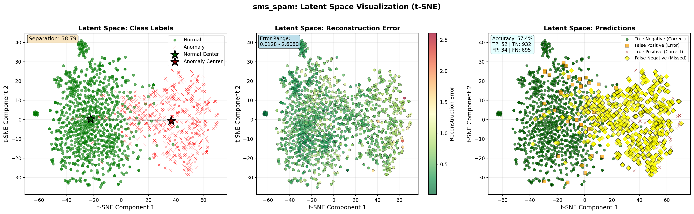

# Mechanistic Anomaly Detection in Transformers via β-VAE Probing

An unsupervised Out-of-Distribution (OOD) and anomaly detection framework that opens the Transformer "black box." 

Instead of relying on standard end-to-end classification or post-hoc Explanable AI (XAI) methods, this project utilizes **Mechanistic Interpretability**. By attaching PyTorch forward hooks directly to the attention mechanism (`q_lin` layers), we extract intermediate query routing representations. We then train a β-Variational Autoencoder (β-VAE) to learn the geometric manifold of "normal" attention queries, allowing us to flag anomalies mechanistically before the model produces a final output.

## 🚀 Key Features

* **Attention Mechanism Probing:** Uses custom PyTorch `forward_hooks` to intercept and extract internal multi-head attention queries (Q) from pre-trained language models (e.g., DistilBERT) during the forward pass.
* **β-VAE Architecture:** A custom PyTorch Variational Autoencoder designed for high-dimensional text embeddings, featuring beta-annealing schedules to prevent posterior collapse (KL vanishing).
* **Unsupervised OOD Detection:** Trains strictly on in-distribution data (One-Class Classification). Anomalies are identified via sample-wise reconstruction error (MSE) mapping.
* **Latent Space Visualization:** Automated t-SNE clustering to visualize the 64-dimensional latent space, generating heatmaps for reconstruction errors, class separation, and prediction confidence.
* **Modular Pipeline:** Object-oriented design supporting multiple Hugging Face datasets (SMS Spam, IMDB, AG News) with automated caching and metric calculation (ROC-AUC, Precision, Recall, F1).

## 🧠 Methodology

1. **Extraction:** Text is passed through a Transformer. A hook on the chosen layer extracts the un-split query embeddings.
2. **Pooling:** Attention masks are applied, and embeddings are mean-pooled across the sequence length.
3. **Training:** The β-VAE learns the distribution N(0, I) of normal queries (e.g., Ham messages). Beta is linearly annealed from 0.0 to 0.3 to ensure rich representation learning.
4. **Inference:** Unseen text is passed through. If the Transformer's attention routes information in an alien way (e.g., Spam), the VAE fails to reconstruct the query, resulting in a high MSE anomaly score.

## 📊 Visualizations

*(Note: Add your generated t-SNE plot and loss curves here)*

**Latent Space Separation (Normal vs. Anomaly)**
<p align="center">
  
</p>

## 🛠️ Installation

Clone the repository and install the required dependencies:

```bash
git clone [https://github.com/YOUR_USERNAME/transformer-vae-probing.git](https://github.com/YOUR_USERNAME/transformer-vae-probing.git)
cd transformer-vae-probing
pip install -r requirements.txt
